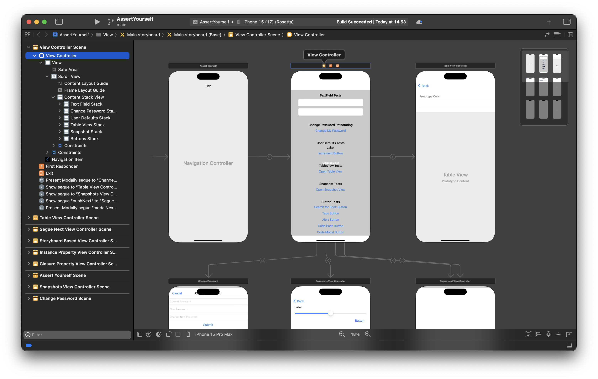
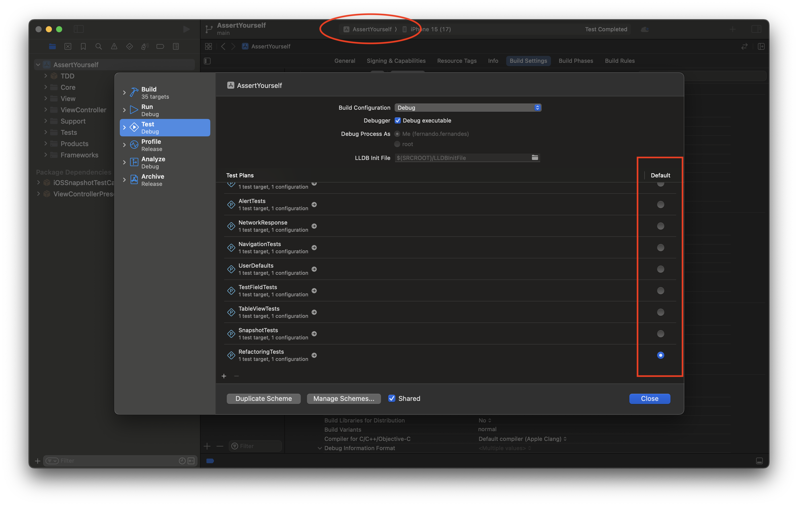
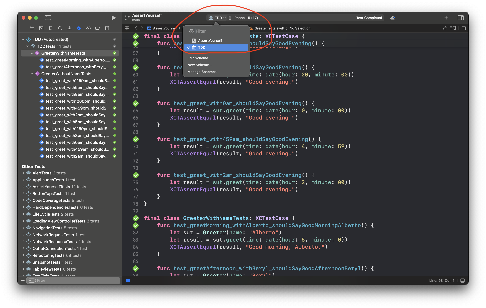

# assert-yourself
This is a repository for the hands-on part of the book ["iOS Unit Testing By Example," by Jon Reid](https://www.goodreads.com/book/show/50824142-ios-unit-testing-by-example).  
([My review.](https://www.goodreads.com/review/show/5414087817))

The project was created with Xcode 15 and conveniently groups all the exercises, TDD package, and third-party dependencies in a single repository.

## Storyboard
The Main Storyboard holds all the target screens/UI elements.

## Test Plans
Change the default test plan to be triggered by `⌘ + u`:

## TDD
Switch to the `TDD` scheme to run TDD tests.

